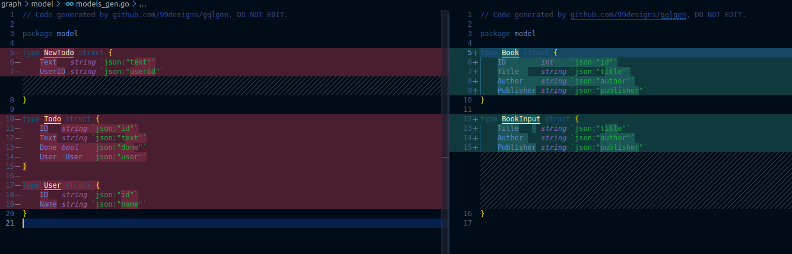

#### step 01: init project

```
go mod init acy.com/gqlgendemo
```

to generate go.mod
Then we get a `go.mod` file which is similar to package.json in JS, details as below.

```go
// acy.com is a name space to avoid duplicate names after publish
module acy.com/gqlgendemo

go 1.17
```

#### step 02: install gqlgen

source: [github](https://github.com/99designs/gqlgen)

```
printf '// +build tools\npackage tools\nimport _ "github.com/99designs/gqlgen"' | gofmt > tools.go
go mod tidy
```

This will generate tools.go, and install dependencies in go.mod

#### step 03: init project by running gqlgen init

```
go run github.com/99designs/gqlgen init
```

This will generate a `server.go` under root directory, and a `graph` folder.

#### Step 03. update graphql schema

update `graph/schema.graphqls` with our own schema
### Create schema

```gql
type Book {
  id: Int!
  title: String!
  author: String!
  publisher: String!
}

input BookInput {
  title: String!
  author: String!
  publisher: String!
}
type Mutation {
  CreateBook(input: BookInput!): Book!
  DeleteBook(id: Int!): String!
  UpdateBook(id: Int!, input: BookInput!): String!
}
type Query {
  GetAllBooks: [Book!]!
  GetOneBook(id: Int!): Book!
}
```

Step 2: running the command to regenerate the whole folder to implement the schema changes

```
go run github.com/99designs/gqlgen
```

Based on your schema, `gqlgen` will auto generate 2 files

`graph/generated.go`

Removed `Todos` and `CreateTodos` from example, and created new Mutation and Query based on your schema

`graph/model/models_gen.go`

```go
// Code generated by github.com/99designs/gqlgen, DO NOT EDIT.

package model

type Book struct {
	ID        int    `json:"id"`
	Title     string `json:"title"`
	Author    string `json:"author"`
	Publisher string `json:"publisher"`
}

type BookInput struct {
	Title     string `json:"title"`
	Author    string `json:"author"`
	Publisher string `json:"publisher"`
}

```



Step 3: Setting up our database connection

Install gorm
`go get gorm.io/gorm`
`go get gorm.io/driver/postgres`

Create a folder `database` then add a `postgres.go` file

```go
package database

import (
    "fmt"

    "acy.com/gqlgendemo/graph/model"
    "gorm.io/driver/postgres"
    "gorm.io/gorm"
)

type Config struct {
    Host     string
    Port     string
    Password string
    User     string
    DBName   string
    SSLMode  string
    Schema   string
}

func NewConnection(config *Config) (*gorm.DB, error) {
    dsn := fmt.Sprintf(
        "host=%s port=%s user=%s password=%s dbname=%s sslmode=%s search_path=%s",
        config.Host, config.Port, config.User, config.Password, config.DBName, config.SSLMode, config.Schema,
    )
    db, err := gorm.Open(postgres.Open(dsn), &gorm.Config{})
    if err != nil {
        return db, err
    }
    return db, nil
}
```

The NewConnection function creates the database connection and returns the database connection if there is no error.

Step 4: Creating the Migration Model

For Migrating the model, You have to **create a model outside the generated model which will allow the adding of gorm tags**, as **the generated model should not be edited**.

Create a `model` folder, and put a `book_model.go` file which has the gorm tags

```go
package models

type Book struct {
    ID        int    `gorm:"primary key;autoIncrement" json:"id"`
    Title     string `json:"title"`
    Author    string `json:"author"`
    Publisher string `json:"publisher"`
}
```

Right after this, go to the `database/postgres.go` file and add the Migrate function under the NewConnection function. The Migrate function:

```go
func Migrate(db *gorm.DB) error {
    return db.AutoMigrate(&models.Book{})
}
```

Step 5: Creating our Repository and CRUD functionalities

For the repository functions, you will create a `repository` folder and in the folder, you will create a `book_repo.go` file, this is where all the code for the book CRUD functionality will be. Four things will be in this file:

```go
package repository

import (
	"acy.com/gqlgendemo/graph/model"
	"acy.com/gqlgendemo/models"
	"gorm.io/gorm"
)

type IBookRepository interface {
	CreateBook(bookInput *model.BookInput) (*models.Book, error)
	UpdateBook(bookInput *model.BookInput, id int) error
	DeleteBook(id int) error
	GetOneBook(id int) (*models.Book, error)
	GetAllBooks() ([]*model.Book, error)
}

type BookRepository struct {
	Db *gorm.DB
}

// CreateBook implements IBookRepository
func (b *BookRepository) CreateBook(bookInput *model.BookInput) (*models.Book, error) {
	book := &models.Book{
        Title:     bookInput.Title,
        Author:    bookInput.Author,
        Publisher: bookInput.Publisher,
    }
    err := b.Db.Create(&book).Error

    return book, err
}

// DeleteBook implements IBookRepository
func (b *BookRepository) DeleteBook(id int) error {
	book := &models.Book{}
    err := b.Db.Delete(book, id).Error
    return err
}

// GetAllBooks implements IBookRepository
func (b *BookRepository) GetAllBooks() ([]*model.Book, error) {
	books := []*model.Book{}
    err := b.Db.Find(&books).Error
    return books, err
}

// GetOneBook implements IBookRepository
func (b *BookRepository) GetOneBook(id int) (*models.Book, error) {
	book := &models.Book{}
    err := b.Db.Where("id = ?", id).First(book).Error
    return book, err
}

// UpdateBook implements IBookRepository
func (b *BookRepository) UpdateBook(bookInput *model.BookInput, id int) error {
	book := models.Book{
        ID:        id,
        Title:     bookInput.Title,
        Author:    bookInput.Author,
        Publisher: bookInput.Publisher,
    }
    err := b.Db.Model(&book).Where("id = ?", id).Updates(book).Error
    return err
}

func NewBookRepository(db *gorm.DB) *BookRepository {
	return &BookRepository{
		Db: db,
	}
}

```

Step 6: Adding the dependencies to the Resolver

In the `graph` folder there is a file called `resolver.go.` if you check it you will see a struct named `Resolver` the function is to hold all the app dependencies used in the development.

In our case, there is only one dependency which is the `book repository`

Before:

```go
package graph

// This file will not be regenerated automatically.
//
// It serves as dependency injection for your app, add any dependencies you require here.

type Resolver struct{}


```

After:

```go
package graph

import "acy.com/gqlgendemo/repository"

// This file will not be regenerated automatically.
//
// It serves as dependency injection for your app, add any dependencies you require here.

type Resolver struct{
	BookRepository repository.IBookRepository
}

```

Step 7: Adding the repository functions to the `schema.resolver`

In the `graph` folder, there is a file called `schema.resolver.go`, present in this file are the functions generated by the schema, each for each CRUD operation w performed in the repository file, they will be added below like this:

Before:

```go
package graph

// This file will be automatically regenerated based on the schema, any resolver implementations
// will be copied through when generating and any unknown code will be moved to the end.

import (
	"context"
	"fmt"

	"acy.com/gqlgendemo/graph/generated"
	"acy.com/gqlgendemo/graph/model"
)

func (r *mutationResolver) CreateTodo(ctx context.Context, input model.NewTodo) (*model.Todo, error) {
	panic(fmt.Errorf("not implemented"))
}

func (r *queryResolver) Todos(ctx context.Context) ([]*model.Todo, error) {
	panic(fmt.Errorf("not implemented"))
}

// Mutation returns generated.MutationResolver implementation.
func (r *Resolver) Mutation() generated.MutationResolver { return &mutationResolver{r} }

// Query returns generated.QueryResolver implementation.
func (r *Resolver) Query() generated.QueryResolver { return &queryResolver{r} }

type mutationResolver struct{ *Resolver }
type queryResolver struct{ *Resolver }

```

After:

```go
package graph

// This file will be automatically regenerated based on the schema, any resolver implementations
// will be copied through when generating and any unknown code will be moved to the end.

import (
	"context"

	"acy.com/gqlgendemo/graph/generated"
	"acy.com/gqlgendemo/graph/model"
)

func (r *mutationResolver) CreateBook(ctx context.Context, input model.BookInput) (*model.Book, error) {
    book, err := r.BookRepository.CreateBook(&input)
    bookCreated := &model.Book{
        Author:    book.Author,
        Publisher: book.Publisher,
        Title:     book.Title,
        ID:        book.ID,
    }
    if err != nil {
        return nil, err
    }
    return bookCreated, nil
}

func (r *mutationResolver) UpdateBook(ctx context.Context, id int, input model.BookInput) (string, error) {
    err := r.BookRepository.UpdateBook(&input, id)
    if err != nil {
        return "nil", err
    }
    successMessage := "successfully updated"

    return successMessage, nil
}

func (r *mutationResolver) DeleteBook(ctx context.Context, id int) (string, error) {
    err := r.BookRepository.DeleteBook(id)
    if err != nil {
        return "", err
    }
    successMessage := "successfully deleted"
    return successMessage, nil
}

func (r *queryResolver) GetOneBook(ctx context.Context, id int) (*model.Book, error) {
    book, err := r.BookRepository.GetOneBook(id)
    selectedBook := &model.Book{
        ID:        book.ID,
        Author:    book.Author,
        Publisher: book.Publisher,
        Title:     book.Title,
    }
    if err != nil {
        return nil, err
    }
    return selectedBook, nil
}

func (r *queryResolver) GetAllBooks(ctx context.Context) ([]*model.Book, error) {
    books, err := r.BookRepository.GetAllBooks()
    if err != nil {
        return nil, err
    }
    return books, nil
}

// Mutation returns generated.MutationResolver implementation.
func (r *Resolver) Mutation() generated.MutationResolver { return &mutationResolver{r} }

// Query returns generated.QueryResolver implementation.
func (r *Resolver) Query() generated.QueryResolver { return &queryResolver{r} }

type mutationResolver struct{ *Resolver }
type queryResolver struct{ *Resolver }

```

Step 8: Creating the main function

`go get github.com/joho/godotenv`

In the `server.go` file there are functions already generated, so what will be done in this article is instantiating the database, running migrations, initiating the repo and adding the repo to the resolver struct as shown below:

Before:

```go
package main

import (
	"log"
	"net/http"
	"os"

	"acy.com/gqlgendemo/graph"
	"acy.com/gqlgendemo/graph/generated"

	"github.com/99designs/gqlgen/graphql/handler"
	"github.com/99designs/gqlgen/graphql/playground"
)

const defaultPort = "7000"

func main() {
	port := os.Getenv("PORT")
	if port == "" {
		port = defaultPort
	}

	srv := handler.NewDefaultServer(generated.NewExecutableSchema(generated.Config{Resolvers: &graph.Resolver{}}))

	http.Handle("/", playground.Handler("GraphQL playground", "/query"))
	http.Handle("/query", srv)

	log.Printf("connect to http://localhost:%s/ for GraphQL playground", port)
	log.Fatal(http.ListenAndServe(":"+port, nil))
}

```

After

```go
package main

import (
	"log"
	"net/http"
	"os"

	"acy.com/gqlgendemo/database"
	"acy.com/gqlgendemo/graph"
	"acy.com/gqlgendemo/graph/generated"
	"acy.com/gqlgendemo/repository"

	"github.com/99designs/gqlgen/graphql/handler"
	"github.com/99designs/gqlgen/graphql/playground"

	"github.com/joho/godotenv"
)

const defaultPort = "7000"

func main() {
	godotenv.Load()

	config := &database.Config{
        Host:     os.Getenv("DB_HOST"),
        Port:     os.Getenv("DB_PORT"),
        Password: os.Getenv("DB_PASS"),
        User:     os.Getenv("DB_USER"),
        SSLMode:  os.Getenv("DB_SSLMODE"),
        DBName:   os.Getenv("DB_NAME"),
		Schema:   os.Getenv("DB_SCHEMA"),
    }

	db, err := database.NewConnection(config)
    if err != nil {
        panic(err)
    }

	database.Migrate(db)

	port := os.Getenv("PORT")
	if port == "" {
		port = defaultPort
	}

	repo := repository.NewBookRepository(db)
	srv := handler.NewDefaultServer(generated.NewExecutableSchema(generated.Config{Resolvers: &graph.Resolver{
		BookRepository: repo,
	}}))

	http.Handle("/", playground.Handler("GraphQL playground", "/query"))
	http.Handle("/query", srv)

	log.Printf("connect to http://localhost:%s/ for GraphQL playground", port)
	log.Fatal(http.ListenAndServe(":"+port, nil))
}

```

Step 9: Add cors

```
go get -u github.com/go-chi/chi/v5
go get github.com/rs/cors
```

And update server.go

```golang
package main

import (
	"log"
	"net/http"
	"os"

	"acy.com/gqlgendemo/database"
	"acy.com/gqlgendemo/graph"
	"acy.com/gqlgendemo/graph/generated"
	"acy.com/gqlgendemo/repository"
	"acy.com/gqlgendemo/service"

	"github.com/99designs/gqlgen/graphql/handler"
	"github.com/99designs/gqlgen/graphql/playground"

	"github.com/joho/godotenv"

	"github.com/go-chi/chi/v5"
	"github.com/rs/cors"
)

const defaultPort = "7000"

func main() {
	godotenv.Load()

	config := &database.Config{
        Host:     os.Getenv("DB_HOST"),
        Port:     os.Getenv("DB_PORT"),
        Password: os.Getenv("DB_PASS"),
        User:     os.Getenv("DB_USER"),
        SSLMode:  os.Getenv("DB_SSLMODE"),
        DBName:   os.Getenv("DB_NAME"),
		Schema:   os.Getenv("DB_SCHEMA"),
    }

	db, err := database.NewConnection(config)
    if err != nil {
        panic(err)
    }

	database.Migrate(db)

	port := os.Getenv("PORT")
	if port == "" {
		port = defaultPort
	}

	router := chi.NewRouter()

	// Add CORS middleware around every request
	// See https://github.com/rs/cors for full option listing
	router.Use(cors.New(cors.Options{
		AllowedOrigins:   []string{"*"},
		AllowCredentials: true,
		Debug:            true,
	}).Handler)

	server := handler.NewDefaultServer(generated.NewExecutableSchema(generated.Config{Resolvers: &graph.Resolver{
		BookService: service.NewBookService(repository.NewBookRepository(db)),
	}}))

	router.Handle("/", playground.Handler("GraphQL playground", "/query"))
	router.Handle("/graphql", server)

	log.Printf("connect to http://localhost:%s/graphql for GraphQL playground", port)
	log.Fatal(http.ListenAndServe(":"+port, router))
}

```